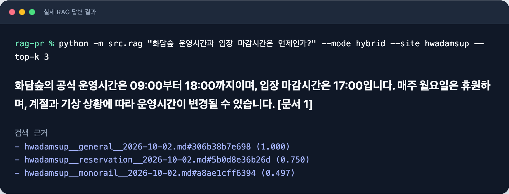
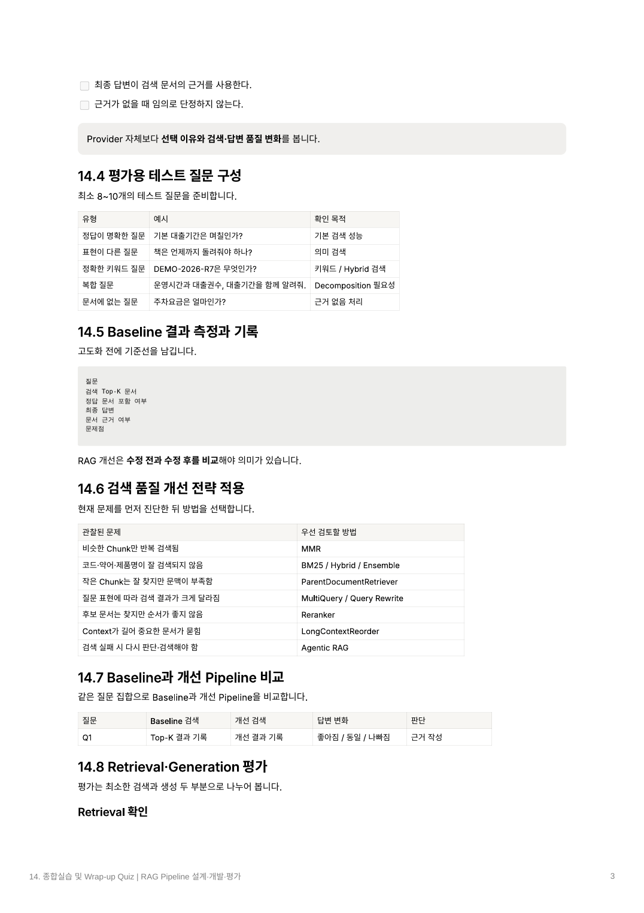
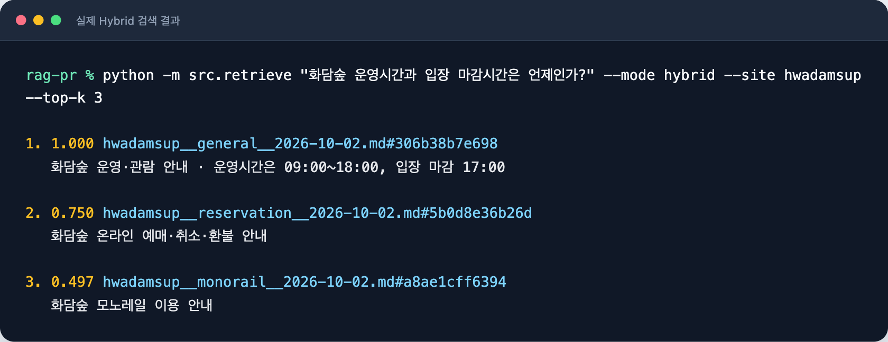
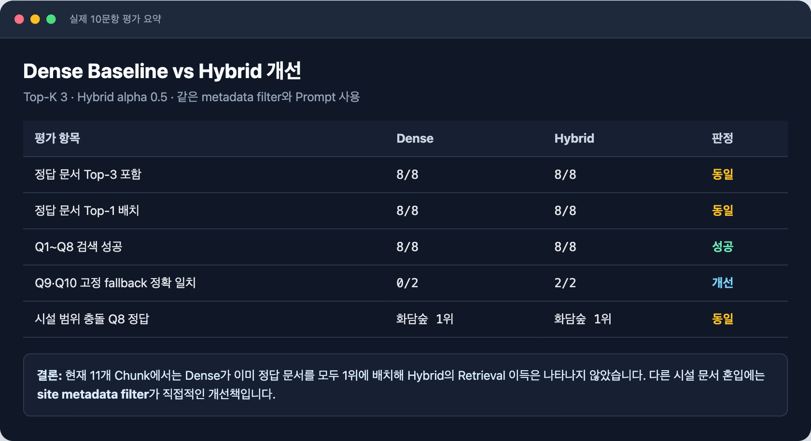
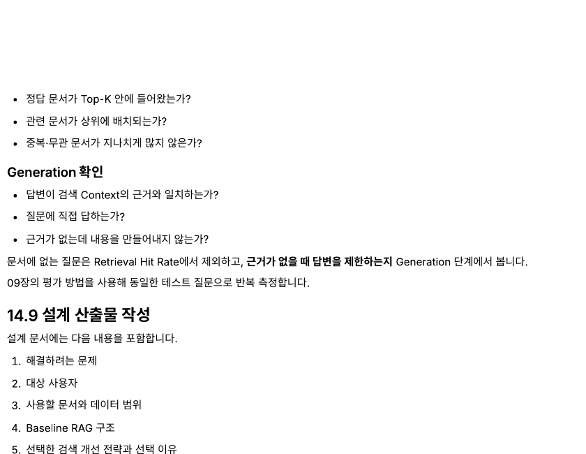

# 숲길잡이 RAG

자연휴양림과 화담숲의 공식 문서를 검색해 예약·입장·환불·시설 이용 질문에 답하는 작은 RAG 프로젝트입니다.   
답변은 검색된 공식 문서에만 근거하며, 근거가 없거나 실시간 조회가 필요한 질문에는 답을 만들어내지 않습니다.

 별도의 제출용 설계 문서는 design[.md](shaping-doc.md)에 있습니다.

## 빠른 실행

```bash
python -m venv .venv
source .venv/bin/activate
python -m pip install -e .
cp .env.example .env
# .env에 OPENAI_API_KEY 입력

python -m src.ingest
python -m src.rag "화담숲 운영시간과 입장 마감시간은 언제인가?" --site hwadamsup
python -m src.evaluate
```

---

## 14.1 종합실습 목표와 구현 범위

### 목표

이 프로젝트의 목표는 다음 순서를 한 번 끝까지 수행하는 것입니다.

1. 기본 Dense RAG를 구현한다.
2. 고정 질문으로 검색 결과와 답변의 문제를 확인한다.
3. 검색 품질 개선 전략을 한 가지 이상 적용한다.
4. 같은 질문으로 Baseline과 개선 Pipeline을 다시 평가한다.
5. 좋아짐·동일·나빠짐을 실제 검색 결과와 답변 근거로 설명한다.


### 구현한 범위

| 구간                 | 구현 내용                                        |
| ------------------ | -------------------------------------------- |
| 문서 수집              | 숲나들e·화담숲 공식 문서 8개                            |
| Loader             | UTF-8 `.md`, `.txt` 파일 로딩                    |
| Splitter           | 문자 단위 800자, overlap 120자                     |
| Metadata           | `site`, `category`, `collected_at`, `source` |
| Embedding          | OpenAI `text-embedding-3-small`              |
| Vector Store       | 별도 DB 없이 `data/index.json`에 저장               |
| Baseline Retriever | Cosine Similarity 기반 Dense Search            |
| 개선 Retriever       | BM25 + Dense Hybrid Search                   |
| 검색 제한              | 시설·문서 유형·수집일 metadata filter                 |
| Generation         | OpenAI Responses API, 기본 `gpt-5-mini`        |
| 평가                 | 동일 10문항 Dense/Hybrid 비교                      |

### 고도화 선택

- [x] BM25 / Hybrid Search
- [x] Metadata Filter
- [ ] MMR
- [ ] ParentDocumentRetriever
- [ ] MultiQuery / Query Rewrite
- [ ] Cross-Encoder Reranker
- [ ] LongContextReorder
- [ ] Agentic RAG

문서가 8개·Chunk가 11개뿐이므로 Vector DB, LangChain, Reranker를 추가하지 않았습니다.   
현재 규모에서는 JSON 인덱스와 직접 구현한 검색 함수로 전체 흐름을 확인할 수 있습니다.

## 14.2 문제 정의와 문서 범위 설정

### ① 어떤 사용자가 질문하는가

- 자연휴양림 또는 화담숲을 처음 방문하는 개인·가족 이용자
- 입장시간, 예약 일정, 환불, 반려동물, 모노레일 규정을 빠르게 확인하려는 이용자
- 여러 공식 페이지를 직접 비교하기 어려운 이용자

### ② 어떤 문서를 검색하는가

비공식 블로그·카페·후기는 제외하고 운영 주체가 게시한 공식 자료만 사용합니다. 모든 데이터 파일에는 출처 URL, 수집일, 적용 대상, 문서 유형을 함께 보존합니다.

| Site        | 대상·내용         | 데이터 파일                                           | 공식 출처                                                                                                                       |
| ----------- | ------------- | ------------------------------------------------ | --------------------------------------------------------------------------------------------------------------------------- |
| `soseonam`  | 소선암 이용수칙      | [문서](data/soseonam__general__2026-10-02.md)      | [숲나들e](https://www.foresttrip.go.kr/pot/rm/ug/selectFcltUseGdncView.do?hmpgId=ID02030041&menuId=004002008&ruleId=208)       |
| `munsusan`  | 문수산 위약금·환불    | [문서](data/munsusan__refund__2026-10-02.md)       | [숲나들e](https://www.foresttrip.go.kr/pot/rm/ug/selectFcltUseGdncView.do?hmpgId=ID02030102&menuId=004002002&ruleId=202)       |
| `seonam`    | 선암 예약·이용 조례   | [문서](data/seonam__reservation__2026-10-02.md)    | [숲나들e](https://www.foresttrip.go.kr/pot/rm/ug/selectRsrvtTermsView.do?hmpgId=ID02030119&menuId=004003002&ruleId=210)        |
| `national`  | 국립 반려견 시설 FAQ | [문서](data/national__pet__2026-10-02.md)          | [숲나들e PDF](https://www.foresttrip.go.kr/com/cm/fileDownload.do?ATTCH_FILE_ID=183583&ATTCH_FILE_MSTER_ID=FILEMSTER_00159817) |
| `national`  | 2026 국립 예약 일정 | [문서](data/national__reservation__2026-10-02.md)  | [숲나들e PDF](https://www.foresttrip.go.kr/com/cm/fileDownload.do?ATTCH_FILE_ID=184443&ATTCH_FILE_MSTER_ID=FILEMSTER_00172708) |
| `hwadamsup` | 화담숲 운영·관람     | [문서](data/hwadamsup__general__2026-10-02.md)     | [화담숲](https://www.hwadamsup.com/m/ko/guide/tour)                                                                            |
| `hwadamsup` | 화담숲 예매·환불     | [문서](data/hwadamsup__reservation__2026-10-02.md) | [화담숲](https://www.hwadamsup.com/m/ko/reservation/informationUse)                                                            |
| `hwadamsup` | 화담숲 모노레일      | [문서](data/hwadamsup__monorail__2026-10-02.md)    | [화담숲](https://www.hwadamsup.com/m/ko/guide/monorail)                                                                        |

화담숲은 자연휴양림이 아니라 수목원이므로 `site=hwadamsup`으로 분리합니다.   
국립자연휴양림 규정을 화담숲에 적용하거나 그 반대로 적용하지 않습니다.

### ③ 어떤 질문까지 답해야 하는가

- 예약 개시일과 신청 방법
- 결제 및 예약 성립 조건
- 취소·환불·위약금 기준
- 입실·퇴실 또는 입장·마감 시간
- 시설 이용수칙과 반입 제한
- 반려동물 동반 조건
- 화담숲 모노레일 이용 규정

다음 항목은 정적 문서 RAG의 범위에서 제외합니다.

- 실시간 잔여 객실·입장권·모노레일 좌석
- 현재 날씨와 교통 상황
- 주변 맛집·관광지 추천
- 실제 예약·결제·취소 실행

### ④ 문서에 근거가 없을 때 어떻게 답하는가

검색 Context에서 답을 확인할 수 없거나 실시간 정보가 필요하면 다음 문장을 사용합니다.

> 제공된 공식 문서에서 확인할 수 없습니다. 최신 정보는 공식 고객센터에서 확인해 주세요.

## 14.3 Baseline RAG 구현

### 전체 기본 흐름

```text
Document
  ↓
Loader → Character Splitter → Embedding → JSON Vector Index
                                                ↓
Question → Query Embedding → Dense Retriever → Top-K Context
                                                ↓
                                      Grounded Prompt → LLM → Answer
```

### Preprocessing: 문서를 검색 가능한 상태로 준비

1. [src/ingest.py](src/ingest.py)가 `data/` 아래의 `.md`, `.txt`를 읽습니다.
2. 빈 줄을 제거한 뒤 기본 `800자`, `120자 overlap`으로 나눕니다.
3. `{site}__{category}__{collected_at}.md` 파일명에서 metadata를 추출합니다.
4. 각 Chunk에 안정적인 ID와 source를 붙입니다.
5. `text-embedding-3-small`로 Embedding합니다.
6. Embedding과 원문·metadata를 `data/index.json`에 저장합니다.

```bash
python -m src.ingest
# 11개 chunk를 data/index.json에 저장했습니다.
```

### Runtime: 질문을 검색하고 답변 생성

1. 질문을 인덱스와 같은 모델로 Embedding합니다.
2. 질문 벡터와 모든 후보 Chunk의 Cosine Similarity를 계산합니다.
3. 점수가 높은 Top-K Chunk를 검색합니다.
4. 검색 문서를 `[문서 N]` 형식으로 Prompt Context에 넣습니다.
5. LLM은 Context에 있는 내용만 사용해 답합니다.

### 검색 결과와 답변 명령의 차이

`src.retrieve`는 답변을 만드는 명령이 아니라 **검색 순위와 문서 조각을 직접 확인하는 디버깅 명령**입니다.

```bash
python -m src.retrieve \
  "화담숲 운영시간과 입장 마감시간은 언제인가?" \
  --mode dense --site hwadamsup --top-k 3
```

자연어 답변이 필요하면 `src.rag`를 사용합니다.

```bash
python -m src.rag \
  "화담숲 운영시간과 입장 마감시간은 언제인가?" \
  --mode dense --site hwadamsup
```

예상 답변:

> 화담숲의 운영시간은 09:00\~18:00이며, 입장 마감시간은 17:00입니다. 매주 월요일은 휴원하며 계절과 기상 상황에 따라 변경될 수 있습니다. [문서 1]

실제 `src.rag` 실행 결과와 검색 근거:



### Baseline 확인 항목

- [x] 공식 문서 8개를 정상적으로 읽는다.
- [x] 기본 설정에서 11개 Chunk와 metadata를 확인했다.
- [x] 질문으로 관련 문서를 검색할 수 있다.
- [x] `src.retrieve`로 검색 문서를 직접 출력한다.
- [x] 최종 답변이 검색 Context의 근거와 문서 번호를 사용한다.
- [x] 문서에 없는 내용을 추측하지 않도록 Prompt에 명시했다.

## 14.4 평가용 테스트 질문 구성



평가 질문은 [evaluation/questions.json](evaluation/questions.json)에 고정합니다. 정답이 명확한 질문, 표현이 다른 질문, 정확 키워드, 복합 조건, 시설 범위 충돌, 문서에 없는 질문을 함께 넣었습니다.

| ID  | 유형         | 질문                                           | 기대 문서·확인 목적  |
| --- | ---------- | -------------------------------------------- | ------------ |
| Q1  | 정답이 명확한 질문 | 소선암자연휴양림의 입실과 퇴실 시간은 언제인가?                   | 소선암 문서 검색    |
| Q2  | 표현이 다른 질문  | 소선암 숙소에는 몇 시부터 들어갈 수 있나?                     | 의미가 같은 표현 검색 |
| Q3  | 정확 키워드 질문  | 2026년 국립자연휴양림 주말 추첨제 신청 기간은 언제인가?            | 연도·추첨제 검색    |
| Q4  | 시설·시간 질문   | 화담숲 운영시간과 입장 마감시간은 언제인가?                     | 시설명·시간 검색    |
| Q5  | 복합 질문      | 문수산의 비수기 주중과 주말 취소·환불 기준을 비교해 달라.            | 여러 조건을 함께 답변 |
| Q6  | 날짜 조건 질문   | 문수산 성수기에 이용일 2일 전 취소하면 얼마가 공제되는가?            | 날짜·주중/주말 조건  |
| Q7  | 시설별 질문     | 국립 반려견 동반 시설 입장 조건은 무엇인가?                    | 지정 시설 조건 검색  |
| Q8  | 범위 충돌 질문   | 국립 반려견 FAQ를 보고 화담숲에도 반려견을 데려갈 수 있다고 답해도 되는가? | 적용 대상 충돌 방지  |
| Q9  | 문서에 없는 질문  | 인근 맛집을 추천해 달라.                               | 근거 없음 처리     |
| Q10 | 실시간 정보 질문  | 최신 실시간 잔여 객실 수를 알려 달라.                       | 정적 RAG 한계 처리 |

Q1\~Q8에는 기대 문서와 시설 filter를 지정합니다. Q9·Q10은 정답 문서가 없으므로 Retrieval Hit Rate에서 제외하고 Generation 단계의 답변 제한을 평가합니다.

## 14.5 Baseline 결과 측정과 기록

### 평가 조건

| 항목              | 값                                              |
| --------------- | ---------------------------------------------- |
| 평가 질문           | 10개                                            |
| 정답 문서가 있는 질문    | 8개                                             |
| Retrieval Top-K | 3                                              |
| Baseline        | Dense Cosine Search                            |
| 동일 적용 조건        | Embedding, Chat Model, Prompt, metadata filter |
| 결과 파일           | [results/evaluation.md](results/evaluation.md) |

### Baseline 결과

| 확인 항목                | 결과  | 해석                           |
| -------------------- | ---: | ---------------------------- |
| 정답 문서 Top-3 포함       | 8/8 | 정답이 있는 모든 질문에서 기대 문서를 찾음     |
| 정답 문서 Top-1 배치       | 8/8 | 기대 문서가 모두 첫 번째에 배치됨          |
| 문서 근거가 있는 답변         | 8/8 | Q1\~Q8 답변이 `[문서 1]` 근거를 사용   |
| 고정 fallback 문장 정확 일치 | 0/2 | Q9·Q10은 의미는 맞지만 문장을 일부 바꿔 출력 |

### 발견한 문제

1. 데이터가 작고 시설 filter를 적용하면 Dense만으로도 정답 문서가 모두 1위여서 검색 개선 폭을 측정하기 어렵습니다.
2. filter 없이 화담숲 운영시간을 검색했을 때 정답은 1위였지만 소선암 입실 문서가 4위에 포함됐습니다. Top-K가 커지면 다른 시설 규정이 Context에 섞일 수 있습니다.
3. Q7처럼 하나의 긴 문서가 여러 Chunk로 나뉘면 동일 source가 Top-K에 반복됩니다.
4. Prompt에서 고정 fallback을 지시했지만 Baseline의 Q9·Q10 답변은 같은 의미로 문장을 바꿨습니다. 정확 문자열이 요구되면 Prompt만으로는 충분하지 않습니다.

## 14.6 검색 품질 개선 전략 적용

### 문제와 전략 연결

| 관찰된 문제             | 적용 전략               | 선택 이유                           |
| ------------------ | ------------------- | ------------------------------- |
| 시설명·연도·수치가 중요함     | BM25 + Dense Hybrid | 정확 키워드와 의미 검색을 함께 사용            |
| 다른 시설 문서가 섞임       | Metadata Filter     | 적용 대상이 다른 후보를 검색 전에 제외          |
| 질문 표현이 달라짐         | Dense Search 유지     | 의미가 같은 자연어 표현 검색에 강함            |
| 동일 source Chunk 반복 | 현재는 허용              | 11개 Chunk에서는 답변 근거 손실보다 단순성이 중요 |

### Hybrid Search 계산 흐름

1. Dense Cosine Similarity를 계산합니다.
2. 질문과 후보 문서의 BM25 점수를 계산합니다.
3. Dense와 BM25 점수를 각각 0\~1로 Min-Max 정규화합니다.
4. `alpha * dense + (1 - alpha) * bm25`로 결합합니다.
5. 결합 점수 기준으로 다시 정렬해 Top-K를 반환합니다.

기본 `alpha=0.5`는 두 검색의 비중을 동일하게 둡니다.

```bash
python -m src.retrieve \
  "화담숲 모노레일 탑승 2시간 전 환불 기준" \
  --mode hybrid --alpha 0.5 --site hwadamsup
```

실제 화담숲 운영시간 질문의 Hybrid 검색 결과:



### Metadata Filter

```bash
# 특정 시설 문서만 검색
python -m src.retrieve "반려동물 동반이 가능한가?" --site hwadamsup

# 특정 시설의 특정 문서 유형만 검색
python -m src.retrieve \
  "모노레일 환불 기준은?" \
  --site hwadamsup --category reservation
```

### 이번 단계에서 추가하지 않은 전략

- MMR: 중복 Chunk가 평가를 방해할 정도로 늘어날 때 추가
- ParentDocumentRetriever: 작은 Chunk의 문맥 부족이 확인될 때 추가
- MultiQuery·Query Rewrite: 표현 차이 질문에서 실패가 생길 때 추가
- Reranker: 후보 문서는 찾지만 순서가 반복해서 틀릴 때 추가
- Agentic RAG: 검색 실패 판단과 재검색이 필요할 때 종료 조건과 함께 추가

## 14.7 Baseline과 개선 Pipeline 비교

같은 질문, 같은 Top-K, 같은 metadata filter를 사용해 Dense와 Hybrid만 바꿨습니다.

```bash
python -m src.evaluate --top-k 3 --alpha 0.5
```

### 비교 결과

| 지표                       | Dense Baseline | Hybrid 개선 | 판단  |
| ------------------------ | --------------: | ---------: | --- |
| 정답 문서 Top-3 포함           | 8/8            | 8/8       | 동일  |
| 정답 문서 Top-1 배치           | 8/8            | 8/8       | 동일  |
| Q1\~Q8 검색 성공             | 8/8            | 8/8       | 동일  |
| Q9·Q10 고정 fallback 정확 일치 | 0/2            | 2/2       | 개선  |
| 범위 충돌 Q8 정답              | 화담숲 문서 1위      | 화담숲 문서 1위 | 동일  |

실제 10문항 평가의 주요 결과:



### 결과 해석

- 현재 데이터에서는 Dense가 이미 정답 문서를 모두 1위에 배치해 Hybrid의 Retrieval 개선이 수치로 나타나지 않았습니다.
- Hybrid를 성공으로 과장하지 않고 **현재 결과는 Retrieval 기준 동일**로 기록합니다.
- 다른 시설 문서가 섞이는 문제에는 Hybrid보다 `site` metadata filter가 직접적인 해결책입니다.
- Q9·Q10에서 Hybrid 답변이 고정 fallback 문장과 일치했지만, 검색 방식이 Generation 문구를 보장하는 것은 아닙니다. 정확 문구 보장은 후처리 또는 근거 충분성 판정이 필요합니다.
- 문서와 질문이 늘어나 정확 키워드 누락 사례가 생길 때 Hybrid의 효과를 다시 측정합니다.

전체 질문별 Top-K와 생성 답변은 [results/evaluation.md](results/evaluation.md)에서 확인할 수 있습니다.

## 14.8 Retrieval·Generation 평가



평가는 검색과 생성을 분리합니다. 정답 문서를 찾는 것과, 찾은 문서를 근거로 올바르게 답하는 것은 서로 다른 문제이기 때문입니다.

### Retrieval 확인

| 확인 질문                  | 확인 방법                            | 현재 결과                  |
| ---------------------- | -------------------------------- | ---------------------- |
| 정답 문서가 Top-K 안에 들어왔는가? | `expected_source`가 검색 결과에 있는지 검사 | Q1\~Q8 모두 포함           |
| 관련 문서가 상위에 배치되는가?      | 기대 문서의 순위 확인                     | Q1\~Q8 모두 1위           |
| 중복·무관 문서가 많지 않은가?      | source와 site를 수동 확인              | Q7에 동일 source Chunk 반복 |
| 시설 범위가 섞이지 않는가?        | `site` filter 전후 비교              | filter 적용 시 다른 시설 제외   |

Q9·Q10은 정답 문서가 없으므로 Retrieval 성공률 계산에서 제외합니다.

### Generation 확인

| 확인 질문                      | 현재 결과                       |
| -------------------------- | --------------------------- |
| 답변이 검색 Context의 근거와 일치하는가? | Q1\~Q8 답변이 검색 문서 내용과 일치     |
| 질문에 직접 답하는가?               | 시간·환불률·입장 조건을 직접 제시         |
| 적용 대상을 구분하는가?              | Q8에서 국립 FAQ를 화담숲에 적용하지 않음   |
| 근거 문서 번호를 표시하는가?           | 근거가 있는 답변에 `[문서 N]` 표시      |
| 근거가 없을 때 내용을 만들지 않는가?      | Q9·Q10 모두 정보 생성 없이 확인 불가 안내 |
| 고정 fallback 문자열을 지키는가?     | Hybrid 2/2, Dense 0/2 정확 일치 |

### 수동 검토 기준

`results/evaluation.md`의 각 질문에서 다음 항목을 원문과 대조합니다.

- [ ] 검색 문서가 질문과 관련 있다.

- [ ] 답변이 검색 문서의 근거와 일치한다.

- [ ] 문서에 없는 내용은 추측하지 않는다.

- [ ] 시설과 수집일의 적용 범위를 잘못 일반화하지 않는다.

---

## 설치 방법

Python 3.10 이상이 필요합니다.

```bash
python -m venv .venv
source .venv/bin/activate
python -m pip install -e .
cp .env.example .env
```

`.env`에는 실제 키를 입력하되 저장소에 제출하지 않습니다.

```dotenv
OPENAI_API_KEY=
OPENAI_CHAT_MODEL=gpt-5-mini
OPENAI_EMBEDDING_MODEL=text-embedding-3-small
```

## 실행 명령 정리

```bash
# 인덱스 생성
python -m src.ingest

# Dense 검색 문서 확인
python -m src.retrieve "소선암 숙소에는 몇 시부터 들어갈 수 있나?" --mode dense

# Hybrid 검색 문서 확인
python -m src.retrieve "2026년 주말 추첨제 신청 기간은?" --mode hybrid

# 시설 범위를 제한한 답변
python -m src.rag "화담숲에 반려동물을 데려갈 수 있나요?" --site hwadamsup

# 동일 10문항 평가
python -m src.evaluate

# API 호출 없는 단위 테스트
python -m unittest discover -s tests -v
```

## 프로젝트 구조

```text
rag-pr/
├── .env.example
├── .gitignore
├── pyproject.toml
├── README.md
├── shaping-doc.md
├── data/
│   ├── README.md
│   ├── *.md
│   └── index.json
├── docs/images/
│   └── guide-*.png
├── evaluation/
│   └── questions.json
├── results/
│   └── evaluation.md
├── src/
│   ├── ingest.py
│   ├── retrieve.py
│   ├── rag.py
│   └── evaluate.py
└── tests/
    └── test_rag.py
```

## 한계와 다음 개선 조건

| 현재 한계                       | 추가 개선을 검토할 조건                |
| --------------------------- | ---------------------------- |
| 정책이 수집일 이후 변경될 수 있음         | 정기 수집이나 갱신일 비교가 필요할 때        |
| 한국어 BM25가 단순 토큰화 사용         | 조사·띄어쓰기 때문에 검색 실패가 반복될 때     |
| 동일 source Chunk가 Top-K에 반복됨 | 중복 때문에 다른 정답 문서를 놓칠 때 MMR 검토 |
| 문자 단위 분할로 조항 경계가 잘릴 수 있음    | 문맥 부족 답변이 발생할 때 문단 기반 분할 검토  |
| Prompt만으로 fallback 문자열을 강제함 | 정확 문자열 준수가 필수일 때 코드 기반 판정 추가 |
| 정적 문서만 검색                   | 실시간 정보가 필요하면 별도 API 도구로 분리   |

GraphRAG, Multimodal RAG, Agentic RAG는 현재 11개 Chunk의 검색·생성 평가가 안정된 뒤에만 검토합니다.
