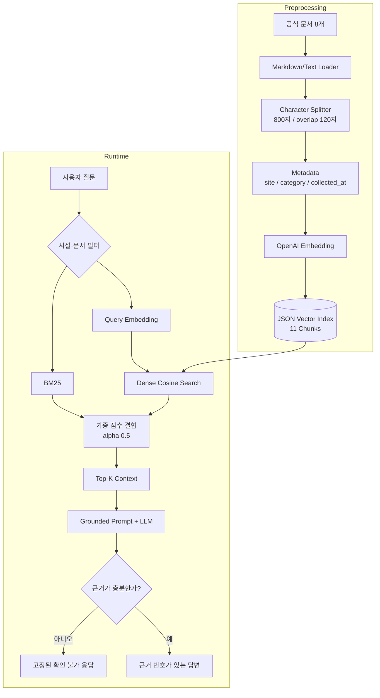

# 숲길잡이 RAG - 설계 산출물

**작성일:** 2026-10-02  
**개발 범위:** 1인 학습 프로젝트, 1주  
**기준 문서:** 14.9 설계 산출물 작성

## 1. 해결하려는 문제

자연휴양림과 화담숲 방문자는 예약 일정, 입장 시간, 결제, 취소·환불, 시설 이용, 반려동물 동반 규정을 여러 공식 페이지에서 따로 찾아야 한다. 시설별 규정과 전국 단위 안내가 함께 검색되면 다른 시설의 규정을 잘못 적용할 수 있고, 실시간 정보나 문서에 없는 내용을 생성 모델이 추측하면 실제 예약과 방문에 피해가 생길 수 있다.

이 프로젝트는 **2026-10-02에 수집한 공식 문서만을 근거로 자연휴양시설 이용 규정 질문에 답하고, 근거가 없으면 답변을 제한하는 RAG 서비스**를 만든다.

### 답변 범위

- 예약 개시일과 신청 방법
- 결제 및 예약 성립 조건
- 취소·환불·위약금 기준
- 입실·퇴실 또는 입장·마감 시간
- 시설 이용수칙과 반입 제한
- 반려동물 동반 조건
- 화담숲 모노레일 이용 규정

### 답변하지 않는 범위

- 실시간 잔여 객실·입장권·모노레일 좌석
- 날씨, 교통, 주변 맛집과 관광 추천
- 예약·결제·취소의 실제 실행
- 수집일 이후 변경된 규정의 확정적 안내

문서에 근거가 없거나 실시간 확인이 필요한 질문에는 다음 문장으로 답변을 제한한다.

> 제공된 공식 문서에서 확인할 수 없습니다. 최신 정보는 공식 고객센터에서 확인해 주세요.

## 2. 대상 사용자

### 주 사용자

- 자연휴양림 또는 화담숲을 처음 예약하는 개인·가족 방문객
- 방문 전에 입장, 환불, 반려동물, 시설 이용 규정을 빠르게 확인하려는 이용자

### 사용 상황

1. 사용자가 일상적인 표현으로 질문한다.
2. 시스템은 시설명과 규정 용어가 포함된 공식 문서를 검색한다.
3. 검색 문서 안에서 확인되는 내용만 짧게 답하고 근거 문서를 표시한다.
4. 시설이 특정되지 않았거나 규정이 충돌하면 적용 대상을 구분하거나 답변을 제한한다.

## 3. 사용할 문서와 데이터 범위

비공식 블로그·카페·후기는 제외하고 운영 주체가 게시한 공식 자료만 사용한다. 모든 문서에는 `출처`, `수집일`, `적용 대상`, `문서 유형`을 기록한다.

| 사이트 식별자 | 적용 대상 | 문서 유형 | 문서 수 |
|---|---|---:|---:|
| `soseonam` | 소선암자연휴양림 | 이용수칙 | 1 |
| `munsusan` | 문수산자연휴양림 | 위약금·환불 | 1 |
| `seonam` | 선암자연휴양림 | 예약·이용 조례 | 1 |
| `national` | 국립자연휴양림 안내 대상 시설 | 예약 일정, 반려견 FAQ | 2 |
| `hwadamsup` | 화담숲 수목원 | 운영·관람, 예매·환불, 모노레일 | 3 |

현재 데이터는 공식 문서 8개이며 기본 설정으로 11개 Chunk가 생성된다. 파일명은 `{site}__{category}__{collected_at}.md` 형식을 사용한다.

화담숲은 자연휴양림이 아니라 수목원이므로 별도 `site=hwadamsup`으로 분류한다. 국립자연휴양림 안내를 화담숲에 적용하거나 화담숲 규정을 자연휴양림에 적용하지 않는다.

## 4. Baseline RAG 구조

### Preprocessing

1. `data/`의 UTF-8 `.md`, `.txt` 문서를 읽는다.
2. 빈 줄을 정리하고 문자 단위로 `800자`, `120자 overlap`으로 분할한다.
3. 파일명에서 `site`, `category`, `collected_at` metadata를 추출한다.
4. `text-embedding-3-small`로 Chunk를 Embedding한다.
5. 문서와 벡터를 `data/index.json`에 저장한다.

### Runtime

1. 질문을 동일한 Embedding 모델로 벡터화한다.
2. 모든 Chunk와 Cosine Similarity를 계산한다.
3. 유사도 상위 Top-K 문서를 Context로 만든다.
4. `gpt-5-mini`가 Context 안의 근거만 사용해 답변한다.
5. 답변에는 `[문서 N]` 형식의 근거를 표시한다.

Baseline은 구현과 설명이 단순한 **Dense Search**다. 의미가 비슷한 표현을 찾는 데 유리하지만 시설명·날짜·규정 용어 같은 정확 키워드와 적용 대상 구분에는 약할 수 있다.

## 5. 선택한 검색 개선 전략과 선택 이유

### 관찰된 문제

`화담숲 운영시간과 입장 마감시간은 언제인가?`를 필터 없이 Dense Search한 결과, 정답인 화담숲 운영 문서가 1위였지만 다른 화담숲 문서와 소선암 입실 문서도 후순위에 포함됐다. 질문과 의미가 비슷한 시간 표현만으로 검색하면 다른 시설의 규정이 Context에 섞일 수 있음을 확인했다.

### 개선 전략 1: BM25 + Dense Hybrid Search

- Dense Search는 `숙소에는 몇 시부터 들어갈 수 있나?`처럼 표현이 달라도 의미가 비슷한 문서를 찾는다.
- BM25는 `화담숲`, `모노레일`, `2시간`, `주말 추첨제`처럼 정확한 시설명·수치·규정 용어를 강조한다.
- 두 점수를 각각 0~1로 정규화한 뒤 `alpha=0.5`로 결합해 순위를 다시 정한다.

하나의 질문에 맞춘 복잡한 Reranker보다 구현과 비교가 간단하고, 정확 키워드와 의미 검색을 동시에 개선할 수 있어 첫 개선 전략으로 선택했다.

### 개선 전략 2: Metadata Filter

`site`, `category`, `collected_at`을 완전 일치 방식으로 필터링한다. 사용자가 화담숲을 지정하면 `site=hwadamsup` 문서만 검색해 다른 휴양림 규정이 섞이는 것을 막는다.

평가에서 Dense와 Hybrid의 차이를 분리하기 위해 같은 질문에는 같은 metadata filter를 적용한다. 필터 유무의 효과는 시설 혼합 질문을 별도 진단해 확인한다.

### 선택하지 않은 전략

- **Cross-Encoder Reranker:** 현재 11개 Chunk에는 과도하다. Hybrid로 정답 문서 순위가 개선되지 않을 때만 추가한다.
- **MultiQuery·Query Rewrite:** 호출 비용과 평가 변수가 늘어난다. 표현 차이 질문에서 Hybrid가 실패할 때 검토한다.
- **Agentic RAG:** 재검색 루프와 종료 조건이 필요한 별도 범위다.
- **Vector DB·LangChain:** 현재 데이터 크기에는 JSON과 표준 Python 구현으로 충분하다.

## 6. 평가 질문과 평가 방법

### 고정 평가 질문

| ID | 유형 | 질문 | 기대 문서 |
|---|---|---|---|
| Q1 | 정답이 명확한 질문 | 소선암자연휴양림의 입실과 퇴실 시간은 언제인가? | 소선암 이용수칙 |
| Q2 | 표현이 다른 질문 | 소선암 숙소에는 몇 시부터 들어갈 수 있나? | 소선암 이용수칙 |
| Q3 | 정확한 키워드 질문 | 2026년 국립자연휴양림 주말 추첨제 신청 기간은 언제인가? | 국립 예약 일정 |
| Q4 | 시설·시간 질문 | 화담숲 운영시간과 입장 마감시간은 언제인가? | 화담숲 운영 안내 |
| Q5 | 복합 질문 | 문수산자연휴양림의 비수기 주중과 주말 취소·환불 기준을 비교해 달라. | 문수산 환불 기준 |
| Q6 | 날짜 조건 질문 | 문수산자연휴양림 성수기에 이용일 2일 전 취소하면 얼마가 공제되는가? | 문수산 환불 기준 |
| Q7 | 시설별 질문 | 국립자연휴양림 반려견 동반 시설에 입장할 때 필요한 조건은 무엇인가? | 국립 반려견 FAQ |
| Q8 | 범위 충돌 질문 | 국립 반려견 FAQ를 보고 화담숲에도 반려견을 데려갈 수 있다고 답해도 되는가? | 화담숲 운영 안내 |
| Q9 | 문서에 없는 질문 | 인근 맛집을 추천해 달라. | 없음 |
| Q10 | 실시간 정보 질문 | 최신 실시간 잔여 객실 수를 알려 달라. | 없음 |

### 비교 조건

- 동일한 10문항과 동일한 metadata filter 사용
- Baseline: Dense Search
- 개선: BM25 + Dense Hybrid Search
- 평가 Top-K: 3
- Hybrid Dense 가중치: 0.5
- 동일 Embedding·Chat 모델과 동일 Prompt 사용

### Retrieval 평가

- 정답 문서가 Top-3 안에 포함됐는가
- 정답 문서가 관련 없는 문서보다 상위에 배치됐는가
- 다른 시설이나 중복 문서가 과도하게 포함되지 않았는가
- Q9·Q10은 정답 문서가 없으므로 Retrieval Hit Rate 계산에서 제외한다

### Generation 평가

- 답변 내용이 검색 Context의 근거와 일치하는가
- 질문에 직접 답하고 적용 대상을 명시하는가
- 근거 문서 번호를 표시하는가
- Q9·Q10에서 고정된 근거 없음 문장으로 답하는가

### 결과 기록

`src/evaluate.py`가 질문별 Dense·Hybrid Top-K, 정답 문서 포함 여부, 두 답변을 `results/evaluation.md`에 기록한다. 사람이 원문과 답변을 대조해 `좋아짐 / 동일 / 나빠짐`과 근거 일치 여부를 최종 판정한다.

## 7. 예상되는 한계와 보완 방법

| 한계 | 영향 | 보완 방법 |
|---|---|---|
| 수집일 이후 정책 변경 | 오래된 요금·시간·환불 규정을 답할 수 있음 | 수집일 표시, 정기 재수집, 최신 공식 페이지 확인 안내 |
| 시설명이 없는 질문 | 다른 시설 규정이 섞일 수 있음 | 시설명 재질문 또는 `site` filter 강제 |
| 단순 한국어 토큰화 | 조사·띄어쓰기 변화로 BM25 점수가 낮아질 수 있음 | 실패 사례가 누적될 때만 형태소 분석기 검토 |
| 문자 단위 Chunk | 표나 조항 경계가 잘릴 수 있음 | 제목·문단 기반 분할 또는 Parent Document 방식 검토 |
| 정적 문서만 사용 | 실시간 잔여 수량을 답할 수 없음 | 실시간 조회는 별도 API 도구로 분리하고 RAG 범위에서 제외 |
| LLM 자동 평가는 없음 | 근거 일치 판정에 사람의 시간이 필요함 | 소규모 골든 답변과 근거 문장 단위 평가셋 추가 |
| 데이터 규모가 작음 | 개선 효과가 우연일 수 있음 | 공식 문서와 질문을 늘리고 동일 평가를 반복 |

## 전체 Pipeline 흐름도

## 설계 결정 및 미해결 항목

### 확정한 결정

- 공식 문서만 사용하고 출처·적용 대상·수집일을 보존한다.
- Dense를 Baseline으로, Hybrid를 첫 개선으로 비교한다.
- 시설별 규정 혼합을 막기 위해 metadata filter를 제공한다.
- 실시간 정보와 추천은 범위에서 제외한다.
- JSON 인덱스와 OpenAI SDK만 사용해 의존성과 구조를 최소화한다.

### 의도적으로 보류한 항목

- `alpha`, Chunk Size, Top-K의 최적값은 10문항 평가 결과가 충분히 쌓인 뒤 조정한다.
- 출처를 문장 단위로 표시하는 기능은 현재 문서·Chunk 단위 근거가 부족할 때 추가한다.
- PDF·표 자동 수집은 텍스트 문서 기반 평가가 안정된 뒤 검토한다.

### 금지 범위

- 비공식 후기로 공식 규정을 보완하지 않는다.
- 시설이 다른 문서를 하나의 공통 규정처럼 합치지 않는다.
- 근거가 없는 답을 모델의 상식으로 채우지 않는다.
- 기본 RAG 평가 전에 GraphRAG·Multimodal RAG·Agentic RAG를 추가하지 않는다.

## 관련 산출물

- `README.md`: 설치·실행·테스트·한계 안내
- `data/`: 공식 문서와 metadata
- `src/ingest.py`: 문서 분할과 인덱싱
- `src/retrieve.py`: Dense·Hybrid 검색 결과 확인
- `src/rag.py`: 근거 기반 답변 생성
- `src/evaluate.py`: 동일 질문 비교 평가
- `evaluation/questions.json`: 고정 평가 질문
- `results/evaluation.md`: 평가 결과
